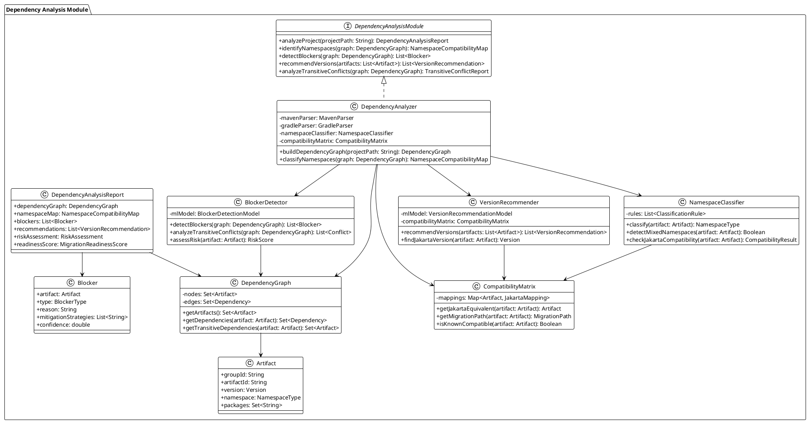
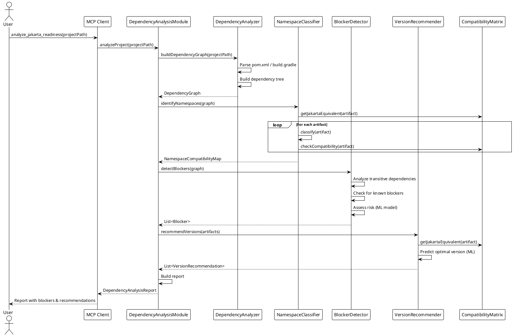
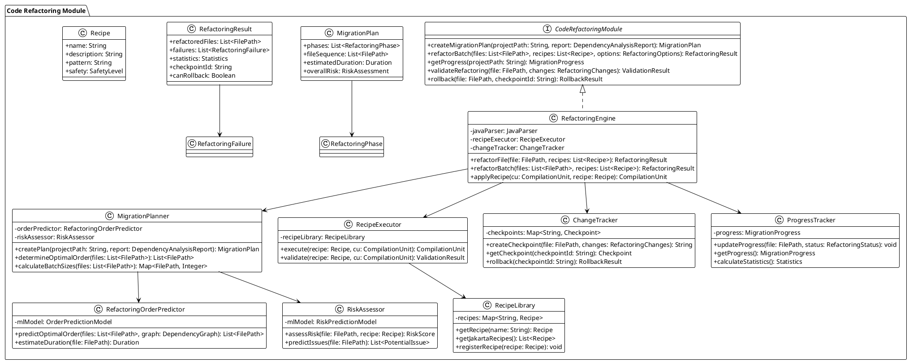
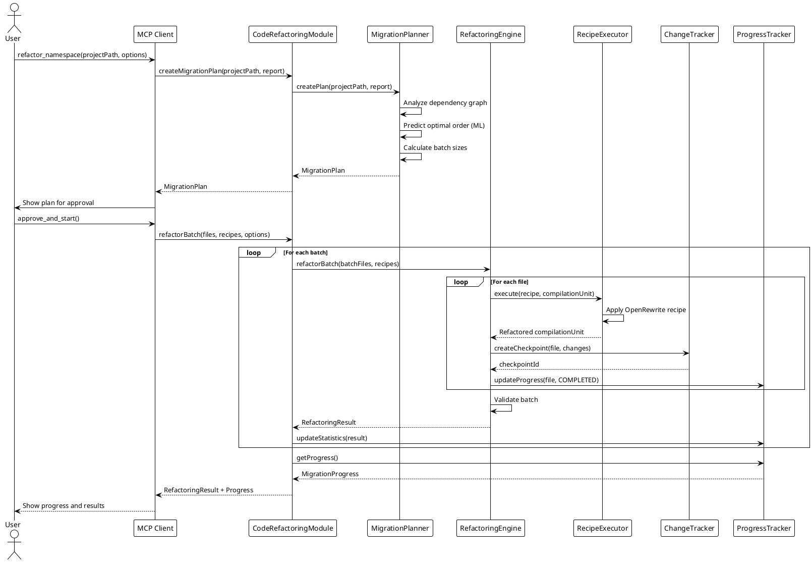
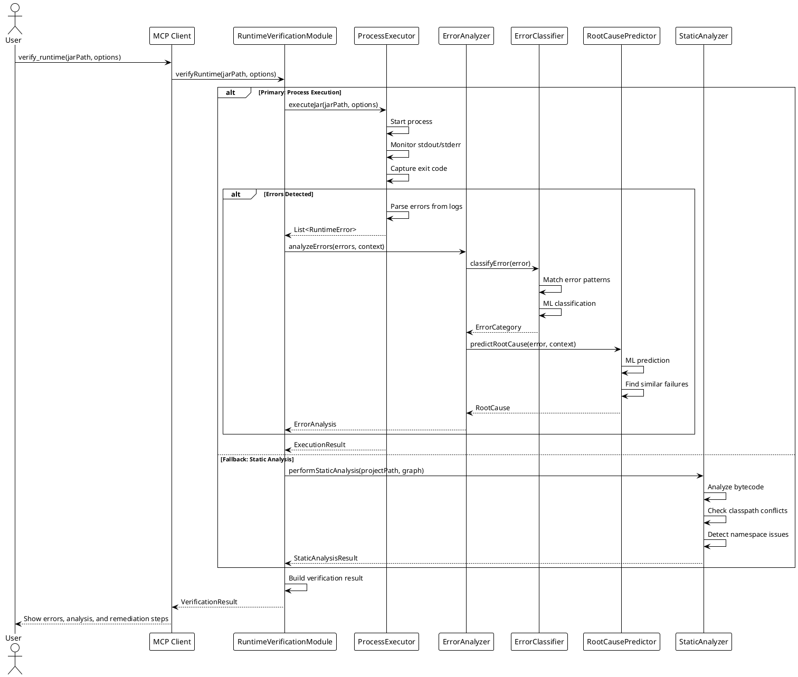
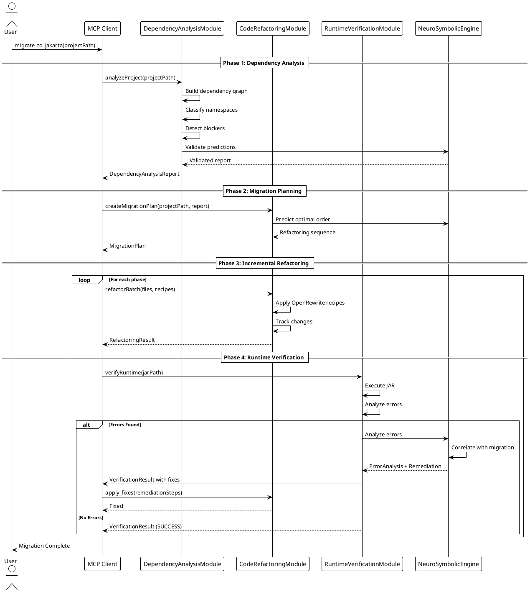
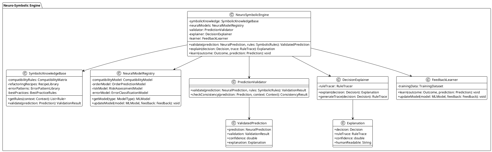

# UML Diagrams for Jakarta Migration MCP Core Modules

This document contains PlantUML diagrams visualizing the architecture of the three core modules.

---

## Module 1: Dependency Analysis Module

### Class Diagram

### Sequence Diagram: Dependency Analysis Flow

---

## Module 2: Code Refactoring Module

### Class Diagram

### Sequence Diagram: Refactoring Flow

---

## Module 3: Runtime Verification Module

### Class Diagram

```plantuml
@startuml RuntimeVerificationModule
!theme plain
skinparam classAttributeIconSize 0

package "Runtime Verification Module" {
    
    interface RuntimeVerificationModule {
        + verifyRuntime(jarPath: String, options: VerificationOptions): VerificationResult
        + analyzeErrors(errors: List<RuntimeError>, context: MigrationContext): ErrorAnalysis
        + performStaticAnalysis(projectPath: String, graph: DependencyGraph): StaticAnalysisResult
        + instrumentClassLoading(jarPath: String, options: InstrumentationOptions): ClassLoaderAnalysisResult
        + performHealthCheck(applicationUrl: String, options: HealthCheckOptions): HealthCheckResult
    }
    
    class ProcessExecutor {
        - processBuilder: ProcessBuilder
        - timeout: Duration
        + executeJar(jarPath: String, options: ExecutionOptions): ExecutionResult
        + monitorProcess(process: Process): ProcessMetrics
        + captureOutput(process: Process): ProcessOutput
    }
    
    class ErrorAnalyzer {
        - errorClassifier: ErrorClassifier
        - rootCausePredictor: RootCausePredictor
        + analyzeErrors(errors: List<RuntimeError>): ErrorAnalysis
        + classifyError(error: RuntimeError): ErrorCategory
        + predictRootCause(error: RuntimeError, context: MigrationContext): RootCause
    }
    
    class ErrorClassifier {
        - mlModel: ErrorClassificationModel
        - patternMatcher: ErrorPatternMatcher
        + classify(error: RuntimeError): ErrorCategory
        + matchPattern(error: RuntimeError): ErrorPattern
    }
    
    class ErrorPatternMatcher {
        - patterns: Map<String, ErrorPattern>
        + match(errorMessage: String): ErrorPattern
        + isJakartaRelated(error: RuntimeError): Boolean
    }
    
    class RootCausePredictor {
        - mlModel: RootCausePredictionModel
        + predict(error: RuntimeError, context: MigrationContext): RootCause
        + findSimilarFailures(error: RuntimeError): List<SimilarFailure>
    }
    
    class StaticAnalyzer {
        - bytecodeAnalyzer: BytecodeAnalyzer
        - classpathAnalyzer: ClasspathAnalyzer
        + analyze(projectPath: String, graph: DependencyGraph): StaticAnalysisResult
        + scanBytecode(jarPath: String): BytecodeReport
        + checkClasspathConflicts(classpath: List<String>): List<Conflict>
    }
    
    class ClassLoaderInstrumenter {
        - agent: ClassLoaderAgent
        + instrument(jarPath: String, options: InstrumentationOptions): ClassLoaderAnalysisResult
        + monitorClassLoading(): ClassLoadingEvents
        + detectFailures(events: ClassLoadingEvents): List<ClassLoadingFailure>
    }
    
    class HealthCheckValidator {
        - httpClient: HttpClient
        + checkHealth(url: String): HealthCheckResult
        + validateEndpoints(endpoints: List<String>): List<EndpointStatus>
    }
    
    class VerificationResult {
        + status: VerificationStatus
        + errors: List<RuntimeError>
        + warnings: List<Warning>
        + metrics: ExecutionMetrics
        + analysis: ErrorAnalysis
        + remediationSteps: List<RemediationStep>
    }
    
    class RuntimeError {
        + type: ErrorType
        + message: String
        + stackTrace: StackTrace
        + className: String
        + timestamp: LocalDateTime
    }
    
    RuntimeVerificationModule <|.. ProcessExecutor
    ProcessExecutor --> ErrorAnalyzer
    ErrorAnalyzer --> ErrorClassifier
    ErrorAnalyzer --> RootCausePredictor
    ErrorClassifier --> ErrorPatternMatcher
    RuntimeVerificationModule <|.. StaticAnalyzer
    RuntimeVerificationModule <|.. ClassLoaderInstrumenter
    RuntimeVerificationModule <|.. HealthCheckValidator
    VerificationResult --> RuntimeError
    VerificationResult --> ErrorAnalysis
}

@enduml
```

### Sequence Diagram: Runtime Verification Flow

---

## Integrated Module Interaction

### Sequence Diagram: Complete Migration Flow

---

## Neuro-Symbolic Engine Architecture

### Class Diagram

---

*Last Updated: 2026-01-27*

